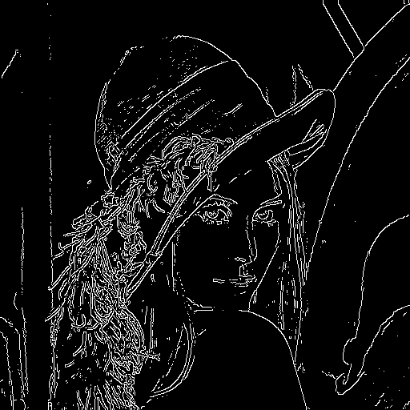
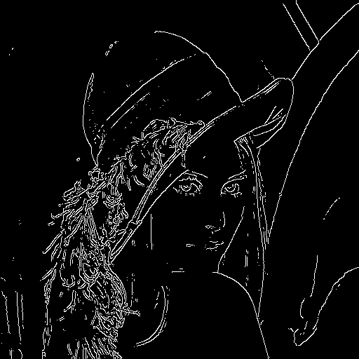
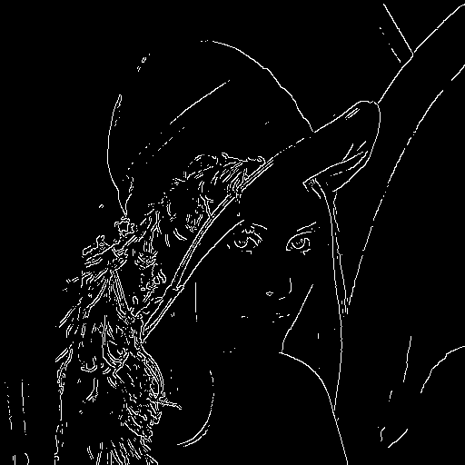
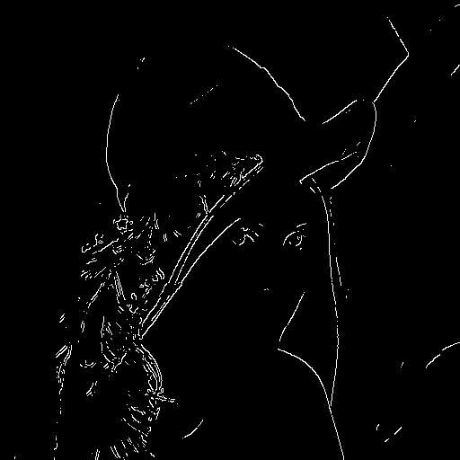

# 미분을 적용한 경계선 검출

#### **python opencv**

</br>

##### 지성현 | 성문고 | 3학년

---

# ✨ Project Information

### | **준비 기간**

  </br>

###### 1개월

</br>

### | **키워드**

  </br>

###### `Computer Science`, `Math`, `python`, `opencv`

---

# 📝 프로젝트 내용

### | 탐구 동기

평소 컴퓨터 비전과 이미지 처리와 같은 분야에 관심이 있었습니다. 영상처리 기술 중 미분을 활용한 경계선 검출 알고리즘인 Canny 알고리즘은 컴퓨터 비전 분야에서 가장 많이 사용되는 기술 중 하나입니다.

최근에 배운 미분을 적용하여 경계선 검출을 구현해보고 싶었기 때문에 해당 주제로 탐구활동을 진행하였습니다.

---

# 📝 프로젝트 내용

### | 주제

영상의 경계선을 미분을 사용한 Canny 경계선 검출 알고리즘을 사용하여 검출하였습니다. 경계선이 검출된 영상을 출력해 보았고 임계점에 따라 다르게 검출되는 경계선 역시 확인해보았습니다.

---

# 📝 프로젝트 내용

### | 교과 연관성

- **수학 영역 연계**: 미분의 개념을 사용하여 영상의 경계를 파악하여 나타낼수 있었다.

---

# 📝 프로젝트 내용

### | 학습 내용

수학 학습 과정에서 배운 미분과 기존에 학습했던 영상처리 기술을 사용하여 이미지의 경계를 임계점을 설정하여 구분하고 표현하였다.

---

# 📝 프로젝트 내용

### | canny 알고리즘

Canny 알고리즘은 이미지에서 경계선을 검출하는 데 사용되는 기술 중 하나입니다.

1. 이미지에서 불필요한 노이즈를 제거합니다. 이를 위해 가우시안 필터를 사용합니다.
2. 이미지에서 경계선의 강도를 계산합니다. 이를 위해 소벨 필터(Sobel filter)를 사용합니다.

---

# 📝 프로젝트 내용

### | canny 알고리즘

3. 경계선이 아닌 영역의 강도를 강제로 0으로 만듭니다. 이를 통해 이미지에서 진짜 경계선을 식별합니다.
4. 이미지에서 경계선이라고 판단되는 픽셀들을 골라내기 위해 이중 임계값을 적용합니다. 높은 임계값과 낮은 임계값을 사용하며, 높은 임계값 이상의 픽셀들은 강한 경계선으로, 낮은 임계값 이상의 픽셀들은 약한 경계선으로 표시합니다.
5. 약한 경계선 중에서 강한 경계선과 연결된 부분만 남기고, 그 외에는 제거합니다. 이를 통해 최종적으로 경계선을 검출합니다.

---

# 📝 프로젝트 내용

### |소벨 필터(Sobel filter)

이미지 처리에서 경계선 검출을 위해 많이 사용되는 필터 중 하나입니다. 이 필터는 이미지에서 x축과 y축 방향으로 각각 미분을 수행하여 경계선 강도를 계산합니다. 소벨 필터는 주로 3x3 또는 5x5 크기의 마스크로 구성되어 있습니다.

---

# 📝 프로젝트 내용

### |소벨 필터(Sobel filter) 3x3 크기의 소벨 필터 예시

x축 방향 미분 필터:
-1 0 1
-2 0 2
-1 0 1

y축 방향 미분 필터:
-1 -2 -1
0 0 0
1 2 1

---

# 📝 프로젝트 내용

### |소벨 필터(Sobel filter) 3x3 크기의 소벨 필터 예시

이 미분 필터를 이미지의 각 픽셀에 적용하여 x축 방향과 y축 방향으로 미분을 수행한 다음, 이를 이용하여 각 픽셀의 경계선 강도를 계산합니다. 이렇게 계산된 경계선 강도를 이용하여, 경계선 검출 알고리즘에서 다음 단계로 넘어갑니다.

---

## 💡 code

- #### 최초 설정

```python
import cv2 as cv

img = cv.imread(
    "C:\\Users\\User\\Documents\\jsh\\2022-03-05-dlaanfdl\\canny\\Lenna.png", cv.IMREAD_GRAYSCALE)
      #이미지이 저장된 경로                                                       #이미지의 색깔

```

---

## 💡 code

- #### 임계점(값) 설정

```python
threshold1 = 100  #임계값 설정(최소)
threshold2 = 100  #임계값 설정(최대)
canny1 = cv.Canny(img, threshold1, threshold2)

threshold1 = 150
threshold2 = 150
canny2 = cv.Canny(img, threshold1, threshold2)

threshold1 = 200
threshold2 = 200
canny3 = cv.Canny(img, threshold1, threshold2)
```

---

## 💡 code

- #### 임계점(값) 설정

```python

threshold1 = 250
threshold2 = 250
canny4 = cv.Canny(img, threshold1, threshold2)

threshold1 = 300
threshold2 = 300
canny5 = cv.Canny(img, threshold1, threshold2)


```

---

## 💡 code

- #### 이미지 보여주기

```python
cv.imshow("Lenna", img)         #origin
cv.imshow("Canny1", canny1)     #첫 번째 설정
cv.imshow("Canny2", canny2)     #두 번째 설정
cv.imshow("Canny3", canny3)     #세 번째 서정
cv.imshow("Canny4", canny4)     #네 번째 설정
cv.imshow("Canny5", canny5)     #다섯 번째 설정

cv.waitKey(0)
cv.destroyAllWindows()


```

---

## 💡 code

- #### 이미지 저장

```python
cv.imwrite(
    "C:\\Users\\User\\Documents\\jsh\\2022-03-05-dlaanfdl\\canny\\Canny1.png", canny1)
cv.imwrite(
    "C:\\Users\\User\\Documents\\jsh\\2022-03-05-dlaanfdl\\canny\\Canny2.png", canny2)
cv.imwrite(
    "C:\\Users\\User\\Documents\\jsh\\2022-03-05-dlaanfdl\\canny\\Canny3.png", canny3)
cv.imwrite(
    "C:\\Users\\User\\Documents\\jsh\\2022-03-05-dlaanfdl\\canny\\Canny4.png", canny4)
cv.imwrite(
    "C:\\Users\\User\\Documents\\jsh\\2022-03-05-dlaanfdl\\canny\\Canny5.png", canny5)
    # 이미지 경로

```

---

## ✅ origin


---

## ✅ 첫 번째 설정(threshold = 100)



---

## ✅ 두 번째 설정(threshold = 150)



---

## ✅ 세 번째 설정(threshold = 200)



---

## ✅ 네 번째 설정(threshold = 250)


---

## ✅ 다섯 번째 설정(threshold = 300)

## 

---

## ✅ 결론

##### 설정한 임계값이 클수록 확실한 경계만 검출되는 것이 확인 되었다. 그 이유는 변화량(미분 값)이 큰 값들만 추출되기 때문이다.
