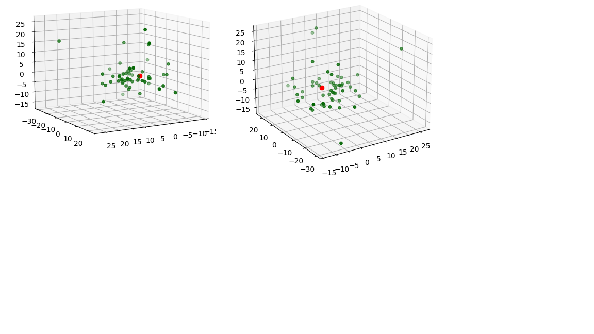

# 우리 은하 구성상단

#### **3D그래프로 표현하기**

</br>

##### 지성현 | 성문고 | 3학년

---

# ✨ Project Information

### | **준비 기간**

  </br>

###### 01개월

</br>

### | **키워드**

  </br>

###### `globular clusters in our galaxy`, `earth science`, `python`, `csv`

---

# 📝 프로젝트 내용

### | 탐구 동기

구상성단에 대해 학습하던 중 우리 은하의 구상성단의 분포가 궁금해졌기 때문이다.


---

# 📝 프로젝트 내용

### | 주제

우리 은하의 구상성단을 3D그래프로 나타내보기

---

# 📝 프로젝트 내용

### | 교과 연관성

**지구 과학 영역 연계** : 구상성단을 그래프로 나타내보앗다.

---

# 📝 프로젝트 내용

### | 활동 내용

3D그래프를 표현하고 그 위에 태양의 위치 등을 점으로 표현하였다.

---

## 💡 code

- #### 최초 설정

```python
import matplotlib.pyplot as plt
from mpl_toolkits.mplot3d import Axes3D
import pandas as pd

data = pd.read_csv('globularclustersinourgalaxy\\globular2.csv')
x = data['x']
y = data['y']
z = data['z']
```

---

## 💡 code

- #### 그래프 표현

```python
fig = plt.figure(figsize=(5, 5))
ax = fig.add_subplot(projection='3d')  # 3D그래프로 지정
ax.view_init(10, 60)  # 그래프가 보이는 각도 지정
ax.scatter(x, y, z, marker='o', s=15, c='darkgreen')
```

---

## 💡 code

- #### 그래프 위에 점으로 표현

```python
ax.scatter(0, 0, 0, marker='o', s=35, c='red')  # 태양의 위치
plt.show()
```

---

## ✅ result


