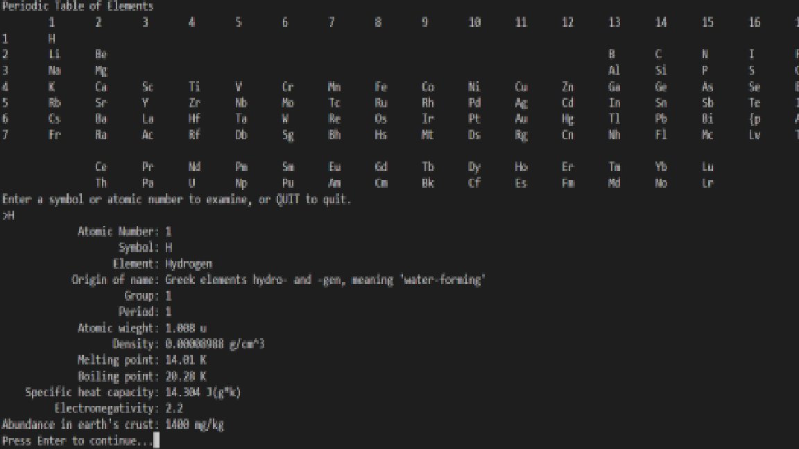

# 원소 주기율표

#### **python csv**

</br>

##### 지성현 | 성문고 | 3학년

---

# ✨ Project Information

### | **준비 기간**

  </br>

###### 1개월

</br>

### | **키워드**

  </br>

###### `periodic table of elements`, `chemistry`, `python`, `csv`

---

# 📝 프로젝트 내용

### | 탐구 동기

주기율표의 원소를 학습할 때 마다 새로 찾아보는 것이 번거로웠기 때문에 원소명으로 검색하여 해당 원소의 정보를 나타내주는 프로그램을 만들게 되었습니다.

---

# 📝 프로젝트 내용

### | 주제

원소명을 검색하면 해당 원소의 다양한 정보를 나타내는 프로그램을 파이썬으로 짜보았습니다.

---

# 📝 프로젝트 내용

### | 교과 연관성

- **화학 영역 연계**: 주기율표의 원소 기호를 검색하여 정보를 나타내었다.

---

# 📝 프로젝트 내용

### | 학습 내용

주기율표의 원소 기호를 검색하여 해당 원소의 이름, 주기, 족, 밀도, 원자량, 전기음성도, 비열 용량 등을 나타낼 수 있게 하여 주기율표의 원소를 외울 때 더욱 많은 도움을 받을 수 있게 하였습니다.

---

## 💡 code

- #### 최초 설정

```python
import csv
import sys
import re
from tkinter import E

elementsFile = open('periodiodictable.csv', encoding='urt-8')
elementsFile2 = open('periodiodictable2.csv', encoding='urt-8')
elementsCsvReader = csv.reader(elementsFile)
elementsCsvReader2 = csv.reader(elementsFile2)
elements = list(elementsCsvReader)
peridictable = elementsCsvReader2
elementsFile.close()
```

---

## 💡 code

- #### 원소 정보 설정

```python
ALL_COLUNS = ['Atomic Number', 'Symbol', 'Element', 'Origin of name',
              'Group', 'period', 'Atomic wieght', 'Density',
              'Melting point', 'Boiling point',
              'Speccific heat capacity', 'Electronegativity',
              'Abundance in earth\'s crust']


LONGEST_COLUMN = 0
for key in ALL_COLUNS:
    if len(key) > LONGEST_COLUMN:
        LONGEST_COLUMN = len(key)
```

---

## 💡 code

- #### 원소 데이터 수집

```python
ELEMENTS = {}
for line in elements:
    element = {'Atomic Number': line[0],
               'Symbol': line[1],
               'Element': line[2],
               'Origin of name': line[3],
               'Group': line[4],
               'period': line[5],
               'Atomic wieght': line[6]+' u',
```

---

## 💡 code

- #### 원소 데이터 수집

```python
               'Density': line[7]+' g/cm^3',
               'Melting point': line[8]+' K',
               'Boiling point': line[9]+' K',
               'Speccific heat capacity': line[10]+' J(g*k)',
               'Electronegativity': line[11],
               'Abundance in earth\'s crust': line[12]+' mg/kg'}
```

---

## 💡 code

- #### 원소 데이터 가공

```python
for key, value in element.items():
    element[key] = - re.sub(r'\[(I|V|X)+\]', '', value)
    ELEMENTS[line[0]] = element
    ELEMENTS[line[1]] = element

```

---

## 💡 code

- #### 주기율표 출력

```python
while True:
    print('Periodic Table of Elements')
    for line in peridictable:
        for i in line:
            print(i, end='\t')
        print()
    print('Enter a symbol or atomic number to examine, or QUIT to quit.')
    response = input('>').title()

    if response == 'Quit':
        elementsFile2.close()
        sys.exit()
```

---

## 💡 code

- #### 원하는 원소 데이터 출력

```python
    if response in ELEMENTS:
        for key in ALL_COLUNS:
            keyJustified = key.rjust(LONGEST_COLUMN)
            print(keyJustified+': '+ELEMENTS[response][key])
        input('Press Enter to continue...')


```

---

## ✅ result


